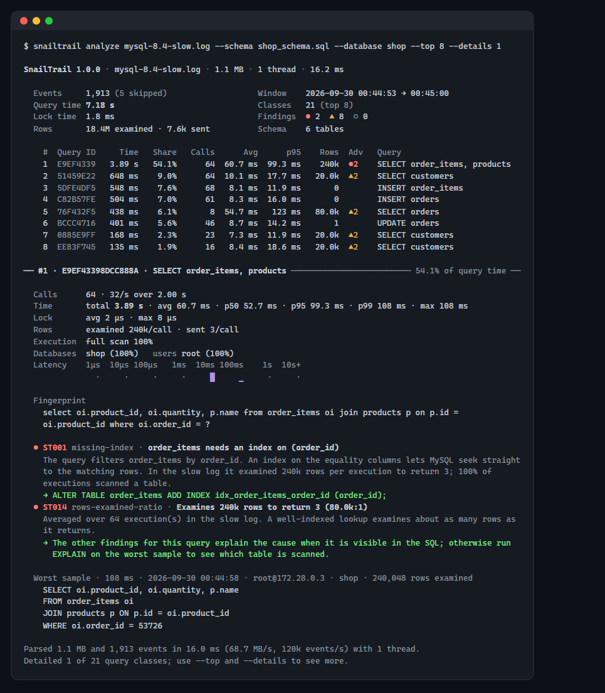
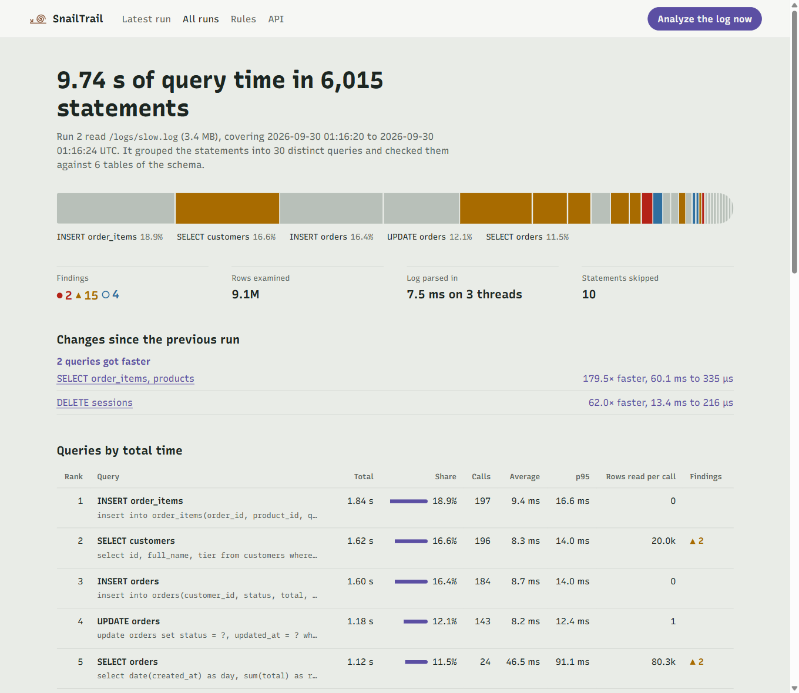
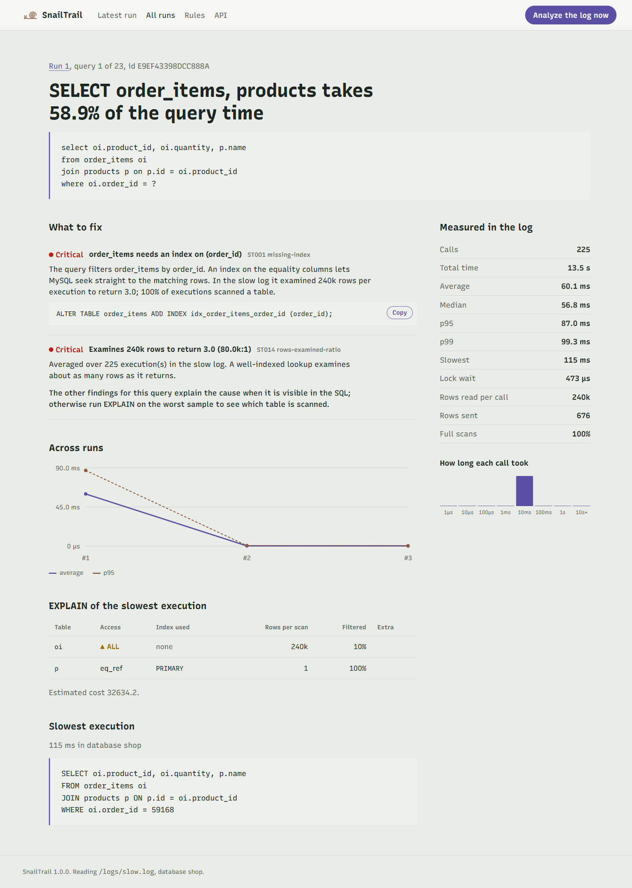
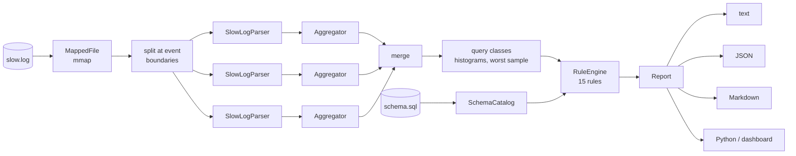

<p align="center">
  
</p>

<h1 align="center">SnailTrail</h1>

<p align="center">
  <strong>Every slow query leaves a trail.</strong><br>
  A MySQL slow-query-log analyser and query advisor: a C++20 engine, a Python dashboard,
  a Docker lab.
</p>

<p align="center">
  <a href="https://github.com/WaynerMoraes12/snailtrail/actions/workflows/ci.yml"></a>
  
  
  
  
  <a href="LICENSE"></a>
</p>

<p align="center"><a href="README.pt-BR.md">Leia em português</a></p>

---

MySQL can write every statement it runs to the **slow query log**, with how long it took,
how many rows it read and whether it scanned a table or sorted on disk. On a busy server
that is gigabytes of text a day, and the question it answers — *where does the database
spend its time, and what do I change?* — is buried in it.

SnailTrail reads that log, groups the statements into **query classes** (the same query
with different values), ranks them by the time they cost the server, and checks each one
against **15 rules**. When it has the schema, it knows which indexes already exist, so the
advice is specific: not "add an index", but the exact `ALTER TABLE ... ADD INDEX` that
serves the query, and the existing index it makes redundant.

<p align="center">
  
</p>

## What is in the box

| | |
|---|---|
| **C++20 engine** ([`core/`](core)) | a zero-copy slow-log parser for MySQL, Percona Server and MariaDB; a hand-written MySQL lexer, fingerprinter and recursive-descent parser; log-linear latency histograms; a rule-based advisor that reads the schema; text, JSON and Markdown reports. Close to 2 GB/s on a laptop, in parallel, with bit-identical results for any thread count. |
| **CLI** ([`cli/`](cli)) | `snailtrail analyze`, `advise`, `fingerprint`, `parse`, `rules`, `generate`. Exit codes make it a CI gate (`--fail-on critical`). |
| **Python package** ([`python/`](python)) | the engine as a pybind11 extension that releases the GIL, typed with stubs. |
| **Dashboard** ([`python/snailtrail/dashboard/`](python/snailtrail/dashboard)) | FastAPI + Jinja2. Keeps every analysis in MySQL, shows what got slower or faster between runs (a `LAG()` window function), and runs `EXPLAIN` on the worst queries. |
| **Lab** ([`python/snailtrail/lab/`](python/snailtrail/lab)) | a MySQL 8.4 shop with 400 000 rows seeded by recursive CTEs, a 20-scenario workload with the mistakes real applications make, and `improve`, which applies SnailTrail's index advice so you can measure it. |
| **Docker** ([`docker/`](docker), [`compose.yaml`](compose.yaml)) | the whole thing in one `docker compose up`; a development image with GCC, Clang and MinGW so the host needs nothing else. |

## Try it in two minutes

With Docker, from a clone of this repository:

```bash
docker compose up -d dashboard
```

That builds the images (running the C++ test suite on the way), starts MySQL 8.4 with the
slow log on, seeds the shop, replays 3 000 requests of the workload and starts the
dashboard, which analyses the log once it is ready. Open **http://127.0.0.1:8080**.

<p align="center">
  
</p>

Now take the advice and measure it:

```bash
docker compose run --rm lab snailtrail-lab improve   # create the suggested indexes, start a new log
docker compose run --rm lab snailtrail-lab run       # run the workload again
```

Press **Analyze the log now**. The second run is compared with the first:

| Query | Before | After | |
|---|---:|---:|---|
| an order's items (`order_items` ⋈ `products` by `order_id`) | 60.1 ms | 0.33 ms | **179× faster**: from 240 000 rows read per call to 6 |
| purging expired sessions (`DELETE FROM sessions WHERE expires_at < ?`) | 13.4 ms | 0.22 ms | **62× faster**: from 20 000 rows read (and locked) per call to none |

Nothing got slower. The writes stay where they were because each one waits for an fsync —
the lab commits every statement on MySQL's durable defaults — and that costs far more than
updating one more index. Differences under 1 ms, or on queries with fewer than 10 calls,
are treated as noise rather than reported as a "3× regression".

An earlier version of the lab replayed the same statements on every run, and its second
run showed primary-key `UPDATE`s 30× faster. They were rewriting values the first run had
already written, which InnoDB skips — no redo, no binlog, no fsync. Each run now draws a
fresh seed; the [lab README](python/snailtrail/lab/README.md#the-workload) has the details.

Each query has its own page: the fix with a copy button, the numbers from the log, its
history across runs, the real `EXPLAIN` plan and the slowest execution.

<p align="center">
  
</p>

Stop everything with `docker compose down -v`.

## The CLI

```bash
snailtrail analyze /var/log/mysql/slow.log --schema schema.sql
snailtrail analyze slow.log --schema schema.sql --database shop --sort p95 --top 10
snailtrail analyze slow.log --format json --output report.json
ssh db1 'cat /var/log/mysql/slow.log' | snailtrail analyze - --schema schema.sql
```

```console
$ snailtrail advise "SELECT id FROM orders WHERE customer_id = 1 AND status = 'paid'
                     ORDER BY created_at DESC LIMIT 20" --schema samples/shop_schema.sql
▲ ST001 missing-index · orders needs an index on (customer_id, status, created_at)
  The query filters orders by customer_id and status and sorts by created_at. idx_orders_customer
  covers only customer_id, so MySQL reads every row that matches it and checks the rest one by one,
  then sorts them (filesort). Equality columns first, then the sort column, lets MySQL seek to the
  matching rows already in order.
  → ALTER TABLE orders ADD INDEX idx_orders_customer_id_status_created_at (customer_id, status,
    created_at);
    Then drop the index it makes redundant: ALTER TABLE orders DROP INDEX idx_orders_customer;

$ snailtrail fingerprint 'SELECT * FROM `Orders` WHERE id IN (1, 2, 3) -- note'
B626FBEF3780CE18  SELECT  select * from orders where id in(?+)
```

As a gate in a pipeline, `--fail-on` turns findings into an exit status, and the Markdown
report goes straight into a job summary:

```bash
snailtrail analyze slow.log --schema schema.sql --fail-on critical --format markdown >> "$GITHUB_STEP_SUMMARY"
```

Every option is in [`cli/README.md`](cli/README.md).

## The rules

| Id | Rule | Looks for |
|---|---|---|
| ST001 | missing-index | the composite index (equalities, then a range or the sort) that serves the query, checked against the existing indexes |
| ST002 | unbounded-write | `UPDATE` or `DELETE` without `WHERE` |
| ST003 | cartesian-join | tables with no join condition between them |
| ST004 | non-sargable-predicate | indexed columns wrapped in functions or arithmetic |
| ST005 | implicit-conversion | string columns compared with numbers (needs the schema) |
| ST006 | leading-wildcard | `LIKE '%...'` |
| ST007 | not-in-subquery | `NOT IN (SELECT ...)`, which matches nothing when the subquery yields a `NULL` |
| ST008 | deep-pagination | `LIMIT` with a large offset |
| ST009 | order-by-rand | `ORDER BY RAND()` |
| ST010 | or-across-columns | `OR` over different columns |
| ST011 | large-in-list | `IN` lists longer than `eq_range_index_dive_limit` |
| ST012 | having-without-aggregate | `HAVING` conditions that belong in `WHERE` |
| ST013 | select-star | `SELECT *` in the outer query |
| ST014 | rows-examined-ratio | rows examined far exceeding rows returned (from the log) |
| ST015 | tmp-tables-on-disk | internal temporary tables spilling to disk (from the log) |

Each finding carries a severity, an explanation with the numbers from the log, and a fix.
The rules are documented in [`core/src/advisor/`](core/src/advisor).

## From Python

```python
import snailtrail

schema = snailtrail.SchemaCatalog.from_ddl(open("schema.sql").read())
report = snailtrail.analyze_file("/var/log/mysql/slow.log", schema=schema, database="shop")

for c in report.classes[:5]:
    print(f"#{c.rank} {c.label:32} {c.total_time_us / 1e6:6.1f} s  p95 {c.p95_us / 1e3:6.1f} ms")
    for f in c.findings:
        print(f"    {f.rule_id} {f.title}\n    {f.suggestion}")
```

`pip install .` builds the extension with CMake through scikit-build-core; the dashboard and
the lab are extras (`pip install ".[dashboard,lab]"`). See [`python/README.md`](python/README.md).

## How it works



- The log is **memory-mapped** and split at event boundaries; each thread parses its chunk
  with its own parser and aggregator, **nothing is locked**, and partial results merge
  deterministically: any thread count gives bit-identical numbers.
- Events are **`string_view`s into the mapping**: the parser copies nothing, and a query
  class keeps only one sample, the slowest.
- Each statement is **fingerprinted** by a hand-written MySQL lexer (literals become `?`,
  `IN (1, 2, 3)` becomes `in(?+)`, comments and case disappear) and hashed with FNV-1a into
  a stable 64-bit class id.
- Latencies go into a **log-linear histogram** (at most 1.6% error, 32 sub-buckets per
  power of two), which merges exactly and gives p50/p95/p99 without keeping the samples.
- The advisor **parses the worst sample** of each class into an immutable AST, collects
  facts with a visitor, and runs the rules; `ST001` asks the `SchemaCatalog` which indexes
  already serve the query.

The full object-oriented analysis — requirements, use cases, domain model, sequence
diagrams, the design patterns and why each one is there, SOLID, concurrency, decisions and
limits — is in **[`docs/ARCHITECTURE.md`](docs/ARCHITECTURE.md)**.

## Performance

A generated log of one million events (652 MB), memory-mapped from the page cache, on an
8-core / 16-thread laptop CPU (Ryzen 7 5825U), GCC 14 Release build, Linux in Docker; best
of three runs, `--no-advice` (advice runs once per query class, not per event):

| Threads | Time | Throughput | Events per second |
|---:|---:|---:|---:|
| 1 | 2.28 s | 286 MB/s | 436 k |
| 4 | 654 ms | 997 MB/s | 1.5 M |
| 8 | 452 ms | 1.4 GB/s | 2.2 M |
| 16 | 343 ms | 1.9 GB/s | 2.9 M |

```bash
snailtrail generate --events 1000000 --output big.log
snailtrail analyze big.log --threads 16 --no-advice
```

The report in the screenshot above — the real 1.1 MB MySQL 8.4 log in
[`samples/`](samples), with the advice — takes about 16 ms on one thread.

## Build from source

Needs CMake 3.21+ and a C++20 compiler: GCC 13+, Clang 17+, MSVC 19.38+ (Visual Studio
2022 17.8) or Apple Clang 16+.

```bash
cmake -S . -B build -DCMAKE_BUILD_TYPE=Release
cmake --build build --parallel
ctest --test-dir build --output-on-failure
build/cli/snailtrail analyze samples/mysql-8.4-slow.log --schema samples/shop_schema.sql
```

Or with nothing but Docker:

```bash
docker build -f docker/dev.Dockerfile -t snailtrail-dev docker/
docker run --rm -v "$PWD:/src:ro" -v snailtrail-build:/build snailtrail-dev sh /src/scripts/check.sh gcc
```

`check.sh` also takes `clang`, `asan` (AddressSanitizer + UndefinedBehaviorSanitizer) and
`mingw` (a native Windows `snailtrail.exe`, cross-compiled). See [`scripts/`](scripts).

## Quality

- **164 C++ tests** (GoogleTest), run on every push with GCC 14, Clang 18, MSVC and Apple
  Clang, and under ASan + UBSan, all with warnings as errors.
- **55 Python tests** (pytest), including the MySQL adapters against a real MySQL 8.4
  server, and `ruff`.
- A **real MySQL 8.4 slow log** in [`samples/`](samples), with tests that expect the verdict
  a person would reach.
- The Docker image cannot be built if a test fails, and the CI runs the lab end to end.

## Repository map

Every folder has a README that explains what it holds and why.

| Folder | What lives there |
|---|---|
| [`core/`](core) | the C++20 library |
| [`core/include/snailtrail/`](core/include/snailtrail) | its public headers, one folder per component |
| [`core/src/util/`](core/src/util) | strings, formatting, hashing, the JSON writer |
| [`core/src/sql/`](core/src/sql) | lexer, fingerprinter, parser, AST, SQL writer |
| [`core/src/schema/`](core/src/schema) | the schema catalog built from DDL |
| [`core/src/log/`](core/src/log) | slow-log parsing, memory mapping, chunking, the generator |
| [`core/src/stats/`](core/src/stats) | histograms, query classes, aggregation |
| [`core/src/advisor/`](core/src/advisor) | query facts, the rules, the index advisor, the rule engine |
| [`core/src/analysis/`](core/src/analysis) | the `Analyzer` facade and the report model |
| [`core/src/report/`](core/src/report) | the text, JSON and Markdown reporters |
| [`cli/`](cli) | the `snailtrail` command-line tool |
| [`bindings/`](bindings) | the pybind11 extension module |
| [`python/`](python) | the Python package: API, [dashboard](python/snailtrail/dashboard), [lab](python/snailtrail/lab), [tests](python/tests) |
| [`tests/`](tests) | the GoogleTest suite |
| [`samples/`](samples) | the shop schema and a real MySQL 8.4 slow log |
| [`docker/`](docker) | the product, MySQL and development images |
| [`cmake/`](cmake) | compiler settings and the MinGW toolchain |
| [`scripts/`](scripts) | build-and-test helper |
| [`docs/`](docs) | the architecture document and [screenshots](docs/img) |
| [`.github/workflows/`](.github/workflows) | continuous integration |

## License

[MIT](LICENSE) © Wayner Moraes
