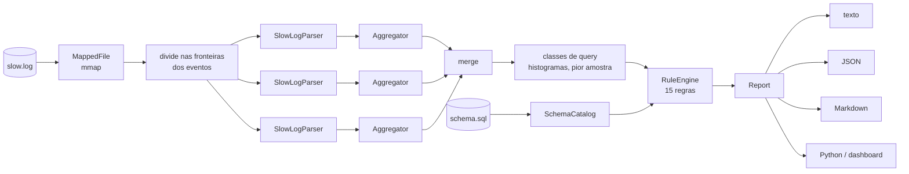

<p align="center">
  
</p>

<h1 align="center">SnailTrail</h1>

<p align="center">
  <strong>Toda query lenta deixa um rastro.</strong><br>
  Um analisador do slow query log do MySQL e consultor de queries: motor em C++20, dashboard
  em Python, laboratório em Docker.
</p>

<p align="center">
  <a href="https://github.com/WaynerMoraes12/snailtrail/actions/workflows/ci.yml"></a>
  
  
  
  
  <a href="LICENSE"></a>
</p>

<p align="center"><a href="README.md">Read in English</a></p>

---

O MySQL pode gravar cada instrução que executa no **slow query log**: quanto tempo levou,
quantas linhas leu, se varreu a tabela inteira ou ordenou em disco. Num servidor movimentado
isso vira gigabytes de texto por dia, e a pergunta que ele responde — *onde o banco gasta o
tempo, e o que eu mudo?* — fica enterrada ali dentro.

O SnailTrail lê esse log, agrupa as instruções em **classes de query** (a mesma query com
valores diferentes), ordena pelo tempo que custaram ao servidor e confere cada uma contra
**15 regras**. Com o schema em mãos, ele sabe quais índices já existem, então o conselho é
específico: não "crie um índice", mas o `ALTER TABLE ... ADD INDEX` exato que atende a
query, e o índice existente que fica redundante.

<p align="center">
  
</p>

## O que vem no projeto

| | |
|---|---|
| **Motor C++20** ([`core/`](core)) | parser zero-copy de slow log para MySQL, Percona Server e MariaDB; lexer, fingerprinter e parser descendente recursivo de MySQL escritos à mão; histogramas de latência log-lineares; um consultor baseado em regras que lê o schema; relatórios em texto, JSON e Markdown. Perto de 2 GB/s num notebook, em paralelo, com resultados idênticos bit a bit para qualquer número de threads. |
| **CLI** ([`cli/`](cli)) | `snailtrail analyze`, `advise`, `fingerprint`, `parse`, `rules`, `generate`. Os códigos de saída fazem dele um portão de CI (`--fail-on critical`). |
| **Pacote Python** ([`python/`](python)) | o motor como extensão pybind11 que libera o GIL, tipada com stubs. |
| **Dashboard** ([`python/snailtrail/dashboard/`](python/snailtrail/dashboard)) | FastAPI + Jinja2. Guarda cada análise no MySQL, mostra o que ficou mais lento ou mais rápido entre execuções (uma window function `LAG()`) e roda `EXPLAIN` nas piores queries. |
| **Laboratório** ([`python/snailtrail/lab/`](python/snailtrail/lab)) | uma loja em MySQL 8.4 com 400 000 linhas geradas por CTEs recursivas, uma carga de 20 cenários com os erros que aplicações reais cometem, e o `improve`, que aplica os índices sugeridos para você medir o efeito. |
| **Docker** ([`docker/`](docker), [`compose.yaml`](compose.yaml)) | tudo com um `docker compose up`; uma imagem de desenvolvimento com GCC, Clang e MinGW, para a máquina não precisar de mais nada. |

## Experimente em dois minutos

Com Docker, a partir de um clone deste repositório:

```bash
docker compose up -d dashboard
```

Isso constrói as imagens (rodando a suíte de testes C++ no caminho), sobe o MySQL 8.4 com o
slow log ligado, popula a loja, executa 3 000 requisições da carga e sobe o dashboard, que
analisa o log assim que ele fica pronto. Abra **http://127.0.0.1:8080**.

<p align="center">
  
</p>

Agora siga o conselho e meça:

```bash
docker compose run --rm lab snailtrail-lab improve   # cria os índices sugeridos e começa um log novo
docker compose run --rm lab snailtrail-lab run       # roda a carga de novo
```

Clique em **Analyze the log now**. A segunda execução é comparada com a primeira:

| Query | Antes | Depois | |
|---|---:|---:|---|
| itens de um pedido (`order_items` ⋈ `products` por `order_id`) | 60,1 ms | 0,33 ms | **179× mais rápida**: de 240 000 linhas lidas por chamada para 6 |
| limpeza de sessões expiradas (`DELETE FROM sessions WHERE expires_at < ?`) | 13,4 ms | 0,22 ms | **62× mais rápida**: de 20 000 linhas lidas (e travadas) por chamada para nenhuma |

Nada ficou mais lento. As escritas continuam onde estavam porque cada uma espera um fsync —
o laboratório faz commit de cada instrução com os padrões duráveis do MySQL — e isso custa
bem mais do que atualizar um índice a mais. Diferenças abaixo de 1 ms, ou em queries com
menos de 10 chamadas, são tratadas como ruído em vez de aparecerem como "regressão de 3×".

Uma versão anterior do laboratório repetia as mesmas instruções a cada execução, e a
segunda execução mostrava `UPDATE`s por chave primária 30× mais rápidos. Eles estavam
regravando valores que a primeira execução já tinha gravado, o que o InnoDB pula — sem redo,
sem binlog, sem fsync. Agora cada execução sorteia uma semente nova; o
[README do laboratório](python/snailtrail/lab/README.md#the-workload) explica.

Cada query tem sua página: a correção com botão de copiar, os números do log, o histórico
entre execuções, o plano `EXPLAIN` real e a execução mais lenta.

<p align="center">
  
</p>

Para parar tudo: `docker compose down -v`.

## A CLI

```bash
snailtrail analyze /var/log/mysql/slow.log --schema schema.sql
snailtrail analyze slow.log --schema schema.sql --database shop --sort p95 --top 10
snailtrail analyze slow.log --format json --output report.json
ssh db1 'cat /var/log/mysql/slow.log' | snailtrail analyze - --schema schema.sql
```

```console
$ snailtrail advise "SELECT id FROM orders WHERE customer_id = 1 AND status = 'paid'
                     ORDER BY created_at DESC LIMIT 20" --schema samples/shop_schema.sql
▲ ST001 missing-index · orders needs an index on (customer_id, status, created_at)
  The query filters orders by customer_id and status and sorts by created_at. idx_orders_customer
  covers only customer_id, so MySQL reads every row that matches it and checks the rest one by one,
  then sorts them (filesort). Equality columns first, then the sort column, lets MySQL seek to the
  matching rows already in order.
  → ALTER TABLE orders ADD INDEX idx_orders_customer_id_status_created_at (customer_id, status,
    created_at);
    Then drop the index it makes redundant: ALTER TABLE orders DROP INDEX idx_orders_customer;

$ snailtrail fingerprint 'SELECT * FROM `Orders` WHERE id IN (1, 2, 3) -- note'
B626FBEF3780CE18  SELECT  select * from orders where id in(?+)
```

Num pipeline, o `--fail-on` transforma achados em código de saída, e o relatório em Markdown
vai direto para o resumo do job:

```bash
snailtrail analyze slow.log --schema schema.sql --fail-on critical --format markdown >> "$GITHUB_STEP_SUMMARY"
```

Todas as opções estão em [`cli/README.md`](cli/README.md).

## As regras

| Id | Regra | Procura |
|---|---|---|
| ST001 | missing-index | o índice composto (igualdades, depois um intervalo ou a ordenação) que atende a query, conferido contra os índices existentes |
| ST002 | unbounded-write | `UPDATE` ou `DELETE` sem `WHERE` |
| ST003 | cartesian-join | tabelas sem condição de junção entre elas |
| ST004 | non-sargable-predicate | colunas indexadas dentro de funções ou aritmética |
| ST005 | implicit-conversion | colunas de texto comparadas com números (precisa do schema) |
| ST006 | leading-wildcard | `LIKE '%...'` |
| ST007 | not-in-subquery | `NOT IN (SELECT ...)`, que não casa nada quando a subquery devolve um `NULL` |
| ST008 | deep-pagination | `LIMIT` com offset grande |
| ST009 | order-by-rand | `ORDER BY RAND()` |
| ST010 | or-across-columns | `OR` entre colunas diferentes |
| ST011 | large-in-list | listas `IN` maiores que `eq_range_index_dive_limit` |
| ST012 | having-without-aggregate | condições no `HAVING` que pertencem ao `WHERE` |
| ST013 | select-star | `SELECT *` na query externa |
| ST014 | rows-examined-ratio | linhas examinadas muito acima das devolvidas (do log) |
| ST015 | tmp-tables-on-disk | tabelas temporárias internas indo para o disco (do log) |

Cada achado traz uma severidade, uma explicação com os números do log e uma correção. As
regras estão documentadas em [`core/src/advisor/`](core/src/advisor).

## Pelo Python

```python
import snailtrail

schema = snailtrail.SchemaCatalog.from_ddl(open("schema.sql").read())
report = snailtrail.analyze_file("/var/log/mysql/slow.log", schema=schema, database="shop")

for c in report.classes[:5]:
    print(f"#{c.rank} {c.label:32} {c.total_time_us / 1e6:6.1f} s  p95 {c.p95_us / 1e3:6.1f} ms")
    for f in c.findings:
        print(f"    {f.rule_id} {f.title}\n    {f.suggestion}")
```

O `pip install .` compila a extensão com CMake via scikit-build-core; o dashboard e o
laboratório são extras (`pip install ".[dashboard,lab]"`). Veja [`python/README.md`](python/README.md).

## Como funciona



- O log é **mapeado em memória** e dividido nas fronteiras dos eventos; cada thread lê seu
  pedaço com seu próprio parser e agregador, **sem nenhum lock**, e os resultados parciais
  se juntam de forma determinística: qualquer número de threads dá os mesmos números, bit a
  bit.
- Os eventos são **`string_view`s dentro do mapeamento**: o parser não copia nada, e cada
  classe de query guarda uma única amostra, a mais lenta.
- Cada instrução recebe um **fingerprint** feito por um lexer de MySQL escrito à mão
  (literais viram `?`, `IN (1, 2, 3)` vira `in(?+)`, comentários e maiúsculas somem) e é
  hasheada com FNV-1a num id de classe estável de 64 bits.
- As latências vão para um **histograma log-linear** (erro máximo de 1,6%, 32 sub-baldes por
  potência de dois), que se junta de forma exata e dá p50/p95/p99 sem guardar as amostras.
- O consultor **faz o parse da pior amostra** de cada classe numa AST imutável, coleta fatos
  com um visitor e roda as regras; a `ST001` pergunta ao `SchemaCatalog` quais índices já
  atendem a query.

A análise orientada a objetos completa — requisitos, casos de uso, modelo de domínio,
diagramas de sequência, os padrões de projeto e por que cada um está ali, SOLID,
concorrência, decisões e limites — está em **[`docs/ARCHITECTURE.md`](docs/ARCHITECTURE.md)**
(em inglês).

## Desempenho

Um log gerado de um milhão de eventos (652 MB), mapeado a partir do page cache, num
processador de notebook de 8 núcleos / 16 threads (Ryzen 7 5825U), GCC 14 em Release, Linux
no Docker; melhor de três execuções, `--no-advice` (o consultor roda uma vez por classe de
query, não por evento):

| Threads | Tempo | Vazão | Eventos por segundo |
|---:|---:|---:|---:|
| 1 | 2,28 s | 286 MB/s | 436 mil |
| 4 | 654 ms | 997 MB/s | 1,5 milhão |
| 8 | 452 ms | 1,4 GB/s | 2,2 milhões |
| 16 | 343 ms | 1,9 GB/s | 2,9 milhões |

```bash
snailtrail generate --events 1000000 --output big.log
snailtrail analyze big.log --threads 16 --no-advice
```

O relatório do primeiro screenshot — o log real de 1,1 MB do MySQL 8.4 em
[`samples/`](samples), com o consultor — leva cerca de 16 ms numa thread.

## Compilando

Precisa de CMake 3.21+ e um compilador C++20: GCC 13+, Clang 17+, MSVC 19.38+ (Visual Studio
2022 17.8) ou Apple Clang 16+.

```bash
cmake -S . -B build -DCMAKE_BUILD_TYPE=Release
cmake --build build --parallel
ctest --test-dir build --output-on-failure
build/cli/snailtrail analyze samples/mysql-8.4-slow.log --schema samples/shop_schema.sql
```

Ou só com Docker:

```bash
docker build -f docker/dev.Dockerfile -t snailtrail-dev docker/
docker run --rm -v "$PWD:/src:ro" -v snailtrail-build:/build snailtrail-dev sh /src/scripts/check.sh gcc
```

O `check.sh` também aceita `clang`, `asan` (AddressSanitizer + UndefinedBehaviorSanitizer) e
`mingw` (um `snailtrail.exe` nativo de Windows, compilado de forma cruzada). Veja
[`scripts/`](scripts).

## Qualidade

- **164 testes C++** (GoogleTest), rodando a cada push com GCC 14, Clang 18, MSVC e Apple
  Clang, e sob ASan + UBSan, sempre com warnings tratados como erro.
- **55 testes Python** (pytest), incluindo os adaptadores MySQL contra um MySQL 8.4 de
  verdade, e `ruff`.
- Um **slow log real do MySQL 8.4** em [`samples/`](samples), com testes que esperam o
  veredito a que uma pessoa chegaria.
- A imagem Docker não é construída se um teste falhar, e o CI roda o laboratório de ponta a
  ponta.

## Mapa do repositório

Cada pasta tem um README (em inglês) explicando o que ela contém e por quê.

| Pasta | O que tem |
|---|---|
| [`core/`](core) | a biblioteca C++20 |
| [`core/include/snailtrail/`](core/include/snailtrail) | os headers públicos, uma pasta por componente |
| [`core/src/util/`](core/src/util) | strings, formatação, hashing, o gerador de JSON |
| [`core/src/sql/`](core/src/sql) | lexer, fingerprinter, parser, AST, gerador de SQL |
| [`core/src/schema/`](core/src/schema) | o catálogo de schema montado a partir do DDL |
| [`core/src/log/`](core/src/log) | parse do slow log, mapeamento em memória, divisão em pedaços, o gerador |
| [`core/src/stats/`](core/src/stats) | histogramas, classes de query, agregação |
| [`core/src/advisor/`](core/src/advisor) | fatos da query, as regras, o consultor de índices, o motor de regras |
| [`core/src/analysis/`](core/src/analysis) | a fachada `Analyzer` e o modelo do relatório |
| [`core/src/report/`](core/src/report) | os relatórios em texto, JSON e Markdown |
| [`cli/`](cli) | a ferramenta de linha de comando `snailtrail` |
| [`bindings/`](bindings) | o módulo de extensão pybind11 |
| [`python/`](python) | o pacote Python: API, [dashboard](python/snailtrail/dashboard), [laboratório](python/snailtrail/lab), [testes](python/tests) |
| [`tests/`](tests) | a suíte GoogleTest |
| [`samples/`](samples) | o schema da loja e um slow log real do MySQL 8.4 |
| [`docker/`](docker) | as imagens do produto, do MySQL e de desenvolvimento |
| [`cmake/`](cmake) | configurações de compilador e o toolchain MinGW |
| [`scripts/`](scripts) | o script de build e testes |
| [`docs/`](docs) | o documento de arquitetura e os [screenshots](docs/img) |
| [`.github/workflows/`](.github/workflows) | integração contínua |

## Licença

[MIT](LICENSE) © Wayner Moraes
