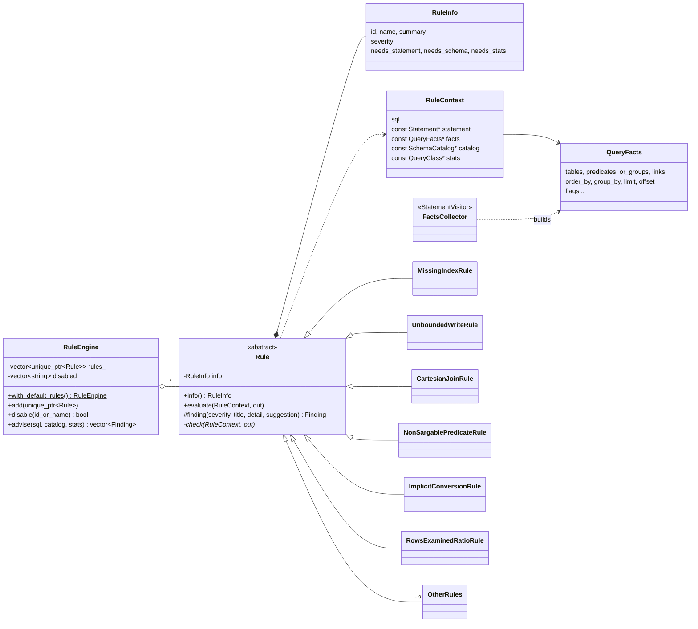

# core/src/advisor

The part that turns *"this query is slow"* into *"here is why, and here is the fix"*.

| File | What it does |
|---|---|
| `finding.cpp` | severities |
| `query_facts.cpp` | the `FactsCollector` visitor: one pass over the AST, resolved columns, classified predicates |
| `rule.cpp` | the `Rule` base class (prerequisites, finding construction) |
| `index_advisor.cpp` | composite-index candidates and rule ST001 |
| `rules_structure.cpp` | rules about the statement's shape (ST002, ST003, ST007, ST008, ST009, ST011, ST012, ST013) |
| `rules_predicates.cpp` | rules about individual predicates (ST004, ST005, ST006, ST010) |
| `rules_metrics.cpp` | rules about what the slow log measured (ST014, ST015) |
| `rule_engine.cpp` | the registry and the `advise()` pipeline |
| `helpers.hpp/.cpp` | small private helpers shared by the rules |

## Design



- **Facts first, rules second.** `collect_facts()` walks the AST once and produces
  `QueryFacts`: every table with its alias, every predicate already classified (equality,
  IN, range, LIKE, IS NULL...), with its column **resolved to a real table** — through the
  alias, the single table of the query, or the schema catalog for unqualified columns in
  joins — and flagged when it sits under an `OR`, under a `NOT`, or inside a function.
  Rules query facts instead of re-walking the tree, so each rule is a few lines of intent
  and the tree-walking logic exists once.
- **Template Method (NVI).** `Rule::evaluate()` is public and non-virtual: it checks the
  rule's prerequisites and then calls the private virtual `check()`. A rule that needs the
  schema is simply not run without one; a rule that needs slow-log metrics is not run when
  advising a single statement. No rule repeats those guards.
- **Metadata is data.** A rule's id, name, summary, default severity and prerequisites are
  a `RuleInfo` given to the base constructor, not six virtual getters per class. Subclasses
  override exactly one function.
- **Open for extension.** A new rule is a class with a constructor and a `check()`, plus one
  line in `make_default_rules()`. The engine, the reporters, the CLI (`snailtrail rules`),
  the Python bindings and the dashboard pick it up without changes.
- **Graceful degradation.** A statement the parser cannot read still gets the metric rules
  and an `ST000` note, instead of silence or a crash.

## Rule catalog

| ID | Name | Severity | Needs | Flags |
|---|---|---|---|---|
| ST001 | `missing-index` | warning → critical | | the composite index that would serve the query, with its `ALTER TABLE` |
| ST002 | `unbounded-write` | critical | | `UPDATE`/`DELETE` without `WHERE` |
| ST003 | `cartesian-join` | critical | | tables no condition relates (a forgotten join) |
| ST004 | `non-sargable-predicate` | warning | | `DATE(col) = ...`, `LOWER(col) = ...`, `col * 1.1 > ...` |
| ST005 | `implicit-conversion` | warning | schema | a string column compared with a number; joins across types |
| ST006 | `leading-wildcard` | warning | | `LIKE '%term%'` |
| ST007 | `not-in-subquery` | warning | | `NOT IN (SELECT ...)` |
| ST008 | `deep-pagination` | warning | | `LIMIT` offsets of 1 000 and more |
| ST009 | `order-by-rand` | warning | | `ORDER BY RAND()` |
| ST010 | `or-across-columns` | info → warning | | `a = ? OR b = ?` |
| ST011 | `large-in-list` | info | | IN lists above `eq_range_index_dive_limit` (200) |
| ST012 | `having-without-aggregate` | info | | `HAVING` conditions that belong in `WHERE` |
| ST013 | `select-star` | info | | `SELECT *` |
| ST014 | `rows-examined-ratio` | warning → critical | slow log | rows examined ≫ rows returned |
| ST015 | `tmp-tables-on-disk` | warning | slow log | internal temporary tables spilling to disk |

Every finding carries a one-line **title**, a **detail** explaining the mechanism (what
MySQL actually does and why it hurts), and a **suggestion** that is, whenever possible,
the SQL of the fix — the `ALTER TABLE`, the `NOT EXISTS` rewrite, the keyset-pagination
`WHERE`, the quoted literal.

## The index advisor (ST001)

For each base table of a SELECT, UPDATE or DELETE, the candidate follows the classic
**equality → range / sort** rule for B-tree indexes:

1. **Equality columns** — `=`, `IN (...)`, `IS NULL`, `<=>` — in any order. Predicates under
   an `OR`, negated, wrapped in a function, or comparing a string column with a number
   (the index could not be used anyway) are left out. A table with no constant equality is
   indexed on its **join** columns instead: it is likely the driven table of the join.
2. Then **one** of:
   - the `ORDER BY` columns — if they all belong to the driving table, go in one direction,
     and either no range exists or the range is on the first sort column: the index then
     returns rows already sorted and a `LIMIT` stops early, no filesort;
   - otherwise the first **range** column (`<`, `>`, `BETWEEN`, `IS NOT NULL`, `LIKE 'prefix%'`);
   - otherwise the `GROUP BY` columns.

With a schema, the candidate is checked against the table's real indexes:

- if an existing B-tree index **already serves** it (equality columns as a permutation of
  its leading columns, then the tail in order) → no finding;
- if an index serves the equality part but not the sort/range → the finding says so;
- plain indexes that are a **prefix** of the candidate become redundant → the suggestion
  also drops them;
- columns the table does not have (an alias, a typo) → no suggestion.

Without a schema, the obvious primary-key lookup (`WHERE id = ?`) is skipped and the
finding says existing indexes were not verified. With slow-log metrics, the evidence is
added (rows examined per row returned, share of executions with a full scan or a
filesort) and a candidate that examines ≥ 10 000 rows at a ≥ 1 000:1 ratio is critical.

Example, on the lab schema:

```sql
SELECT id, total FROM orders
WHERE customer_id = 812 AND status = 'paid'
ORDER BY created_at DESC LIMIT 20
```

```
▲ ST001 orders needs an index on (customer_id, status, created_at)
  The query filters orders by customer_id and status and sorts by created_at.
  idx_orders_customer covers only customer_id, so MySQL reads every row that matches it
  and checks the rest one by one, then sorts them (filesort). Equality columns first, then
  the sort column, lets MySQL seek to the matching rows already in order.
  → ALTER TABLE orders ADD INDEX idx_orders_customer_id_status_created_at (customer_id, status, created_at);
    Then drop the index it makes redundant: ALTER TABLE orders DROP INDEX idx_orders_customer;
```

## Limits

The advisor reasons about one statement at a time, without row counts or cardinalities:
it cannot tell that an index on a boolean column is useless, or that a table has ten rows.
Facts come from the outer query; subqueries and derived tables are not advised
separately, and a `UNION` is advised on its first branch. These are heuristics a person
would apply first — the findings say *what to check*, and `EXPLAIN` confirms it.
