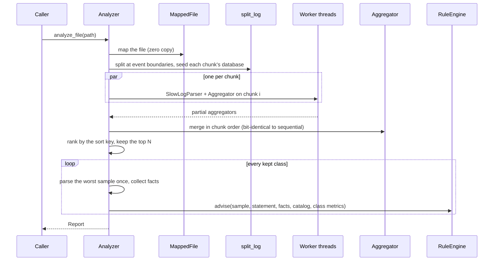

# core/src/analysis

One class that runs everything: `Analyzer` is a **facade** over the modules below it.

| File | What it does |
|---|---|
| `analyzer.cpp` | the pipeline: map, split, parse in parallel, merge, rank, advise |
| `report.cpp` | sort keys, class labels, finding counts |

```cpp
const analysis::Analyzer analyzer(options, &catalog);
const analysis::Report report = analyzer.analyze_file("slow.log");
```

## The pipeline



- **Parallelism without shared state.** Each worker owns its parser and its aggregator;
  nothing is locked. A small RAII `Workers` owns the threads and joins them on scope exit
  (`std::jthread` would do the same, but Apple's libc++ still ships it as experimental).
  An exception thrown in a worker is captured as an `std::exception_ptr` and rethrown on
  the calling thread after every worker has finished.
- **The database, resolved after the fact.** A chunk cannot know which database is in
  effect before its first `use db;` line without reading every chunk before it. Instead of
  a pre-scan, chunks after the first start with a sentinel database; when all workers are
  done, each partial aggregator renames the sentinel to the database inherited from the
  chunks before it (`Aggregator::rename_database`) — a handful of tally updates instead of
  a second pass over the file. Only `--database` filtering needs the database *while*
  parsing; that mode pre-scans in parallel and synchronises the workers with a C++20
  `std::latch` before they parse.
- **Deterministic output.** Partial results merge in chunk order and ties in the ranking
  break on the class id, so a report does not depend on the thread count or the hash-map
  iteration order. `ResultsDoNotDependOnTheThreadCount` compares one thread with eight,
  down to every finding's text.
- **Each sample is parsed once.** The worst sample of a class is parsed, its facts
  collected (which also names the tables for the report's label), and the same statement
  and facts are handed to the rule engine.
- **Three entry points, one pipeline.** `analyze_file` memory-maps and parallelises;
  `analyze_text` does the same over a string (tests, Python); `analyze_stream` feeds a
  parser line by line in constant memory (`snailtrail analyze -` reading a pipe).

## Options

| Option | Effect |
|---|---|
| `threads` | worker count; 0 = `std::thread::hardware_concurrency()` |
| `min_chunk_bytes` | never split below this size per chunk (default 1 MiB) |
| `top` | keep the N classes that rank highest; 0 keeps all |
| `sort` | rank by total time, calls, average, p95, max, or rows examined |
| `database` | keep only events run against this database |
| `min_severity` | drop findings below this severity |
| `advise` | run the advisor at all |

`Analyzer` is neither copyable nor movable: it may point at its own default rule engine.
