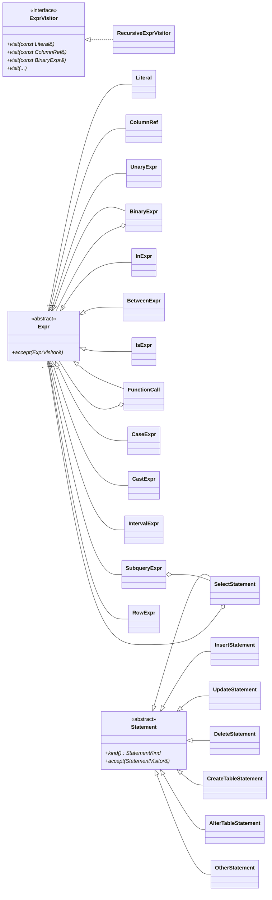

# core/src/sql

Everything SnailTrail knows about SQL text.

| File | What it does |
|---|---|
| `token.cpp` | token kind names, identifier and string-literal unquoting |
| `lexer.cpp` | the lexer |
| `keywords.cpp` | the few word lists the fingerprinter and parser need |
| `statement_kind.cpp` | SELECT / INSERT / UPDATE / DDL / ... classification |
| `fingerprint.cpp` | query fingerprints and class ids |
| `ast.cpp` | the abstract syntax tree: expression and statement nodes, `RecursiveExprVisitor` |
| `parser.cpp` | the recursive-descent parser |
| `sql_writer.cpp` | AST → SQL text, with only the parentheses precedence requires |
| `ast_printer.cpp` | AST → a box-drawn tree (`snailtrail parse`) |

## Lexer

Hand-written, single pass, **zero-copy**: a `Token` is a `std::string_view` into the
statement plus its kind and byte offset.

It is **lenient by design**. A slow log is written by a server, but it can be truncated
mid-statement or carry binary data inside string literals. The lexer never throws: an
unterminated string runs to the end of the input and an unknown byte becomes a
one-character operator.

What it understands of MySQL's dialect:

| Construct | Examples |
|---|---|
| comments | `-- x` (the space is required: `1--1` is `1 - -1`), `# x`, `/* x */`, optimizer hints `/*+ BKA(t) */` |
| executable comments | `/*!40101 SET ... */` is **lexed**, because MySQL runs its content |
| strings | `'it''s'`, `"say \"hi\""`, `N'x'`, `_utf8mb4'x'` |
| identifiers | `` `order` ``, ``` `we``ird` ```, words starting with a digit (`1st_place`) |
| numbers | `42`, `3.14`, `.5`, `1e-3`, `0x1F`, `X'1F'`, `0b01`, `B'01'` |
| variables | `@x`, `@'quoted name'`, `@@session.sql_mode` |
| operators | longest match: `<=>`, `->>`, `<=`, `>=`, `<>`, `!=`, `||`, `&&`, `:=`, `->`, `<<`, `>>` |

**Keywords are not a token kind.** In MySQL `status`, `date`, `left` and `comment` are
keywords *and* legal column names, so every word is a `Word` and the parser decides from
context. The lists in `keywords.cpp` are sorted at compile time — a `static_assert` fails
the build if someone inserts a word out of order, because lookups are binary searches.

## Fingerprints

A fingerprint is a query with its values taken out. Two executions with different
values belong to the same **query class**:

```sql
SELECT * FROM `Orders` WHERE id = 42 AND status IN ('paid', 'sent')  -- dashboard
select * from orders where id = ? and status in(?+)
```

Normalisation works on the **token stream**, never with regular expressions, so a `?`, a
keyword or a comment marker inside a string literal can never confuse it:

| Rule | Before | After |
|---|---|---|
| literals become `?` | `id = 42`, `name = 'x'`, `0x1F` | `id = ?` |
| a sign is part of the number | `x = -5` | `x = ?` |
| ...but subtraction is kept | `a - 1` | `a - ?` |
| IN lists collapse | `IN (1, 2, 3, NULL)` | `in(?+)` |
| subqueries are kept | `IN (SELECT ...)` | `in (select ...)` |
| multi-row inserts collapse | `VALUES (1,'x'), (2,'y')` | `values(?+)` |
| identifiers are unquoted and lower-cased | `` `Orders` `` | `orders` |
| comments and formatting vanish | any spacing, `-- x`, `/* x */` | canonical spacing |
| trailing `;` is dropped | `select 1;` | `select ?` |

Spacing is **regenerated** from the tokens, not collapsed from the source, so two ORMs that
format the same query differently still produce one class. Function calls keep their
parenthesis attached (`count(*)`, `now()`), groups after keywords get a space
(`from (select`, `and (a or b)`).

The class id is **FNV-1a-64 of the fingerprint text** (see [`util`](../util)): the same
query class gets the same id on every platform and every run, which is what lets the
dashboard follow a query across analyses.

### Performance

The hot path of an analysis is one fingerprint per slow-log event. A `Fingerprinter`
keeps its token vector between calls and `compute_into()` reuses the caller's string, so
after warm-up fingerprinting allocates nothing. It is not thread-safe on purpose: every
worker thread owns one.

## Statement kinds

`classify_statement()` looks at the first word, skipping leading parentheses
(`(SELECT ...) UNION (SELECT ...)`). For `WITH`, it walks past the CTE definitions — which
sit inside parentheses — to the first DML word at depth 0, so
`WITH recent AS (SELECT ...) DELETE FROM ...` is a DELETE.

## Abstract syntax tree

The fingerprint answers *"which queries are the same?"*. The advisor needs more: *which
columns are compared to constants, which tables are joined on what, is there a function
around that column?* That takes a real parse.



Design decisions:

- **Composite + Visitor.** Nodes are a closed class hierarchy; operations over them
  (writing SQL, drawing the tree, computing precedence, collecting advisor facts) are
  visitors. Adding an *operation* never touches the nodes — and that is the axis that
  changes here: the node set follows MySQL's grammar, the operations follow the product.
  `RecursiveExprVisitor` walks children by default, so a visitor that only cares about
  columns overrides one method.
- **Immutable, owned by `unique_ptr`.** Nodes are built once and never modified; accessors
  are `const`. Copy and move are deleted on the polymorphic bases, so nothing can be
  sliced. Clause aggregates with no invariant (`TableRef`, `Join`, `OrderItem`, `Limit`)
  are plain structs.
- **Only the parser builds statements.** Statement classes expose `const` accessors and
  declare `friend class Parser`: consumers see a read-only tree, and there is no
  half-built public setter API to misuse.
- **`CREATE INDEX` is an `AlterTableStatement`.** It *is* `ALTER TABLE ... ADD INDEX`, and
  the schema catalog then handles one statement type instead of two.
- **INSERT rows are counted, not parsed.** A bulk insert can carry 10 000 rows; the advisor
  needs the count, not 10 000 expression trees.

## Parser

Recursive descent for statements, **precedence climbing** for expressions, following
[MySQL's operator precedence](https://dev.mysql.com/doc/refman/8.4/en/operator-precedence.html):

| Level | Operators |
|---|---|
| 1 | `:=` (right-associative) |
| 2 | `OR`, `\|\|` |
| 3 | `XOR` |
| 4 | `AND`, `&&` |
| 5 | `NOT` |
| 6 | `=` `<=>` `<>` `!=` `<` `<=` `>` `>=` `IS` `LIKE` `REGEXP` `IN` `BETWEEN` |
| 7–9 | `\|`, `&`, `<<` `>>` |
| 10–12 | `+` `-`, `*` `/` `DIV` `%` `MOD`, `^` |
| 13 | unary `-` `+` `~` `!` `BINARY` |
| 14 | `->` `->>` `COLLATE` |

Coverage: SELECT (CTEs, `DISTINCT`, joins of every kind, derived tables, subqueries with
`EXISTS`/`IN`/`ANY`/`ALL`, `GROUP BY ... WITH ROLLUP`, `HAVING`, window functions,
`UNION`/`EXCEPT`/`INTERSECT`, every `LIMIT` form, `FOR UPDATE`/`FOR SHARE`/`LOCK IN SHARE
MODE`, index hints), INSERT/REPLACE (`VALUES`, `SET`, `SELECT`, `ON DUPLICATE KEY UPDATE`),
UPDATE and DELETE (single- and multi-table, `USING`, `ORDER BY ... LIMIT`), and the DDL a
`mysqldump --no-data` produces: `CREATE TABLE` with every column attribute and key type,
`CREATE INDEX`, `ALTER TABLE ADD/DROP INDEX`. Special function syntaxes are handled:
`CAST(x AS t)`, `CONVERT(x USING cs)`, `EXTRACT(u FROM x)`, `TRIM(LEADING c FROM x)`,
`SUBSTRING(x FROM a FOR b)`, `POSITION(a IN b)`, `GROUP_CONCAT(... ORDER BY ... SEPARATOR
...)`, `MATCH(...) AGAINST(...)`, niladic `CURRENT_TIMESTAMP`, typed literals
`DATE '2024-01-01'`.

Behaviour worth knowing:

- **Errors carry a position.** `ParseError::offset()` points at the offending token:
  `expected an expression but found end of statement at offset 21`.
- **Scripts keep going.** `parse_script()` records an error, skips to the next `;` and
  continues, so one exotic statement in a 3 000-line dump costs one table, not the file.
- **Keywords that are column names stay column names.** `status`, `date`, `comment`,
  `level` and even `end` parse as columns; only MySQL's reserved words need backticks,
  exactly as in MySQL.
- **Bounded recursion.** Every recursive production holds a `DepthGuard`; 5 000 nested
  parentheses or `NOT NOT NOT ...` produce a `ParseError`, never a stack overflow. The
  tests run this under AddressSanitizer.
- **Deliberate gaps.** Stored-program bodies, `SOUNDS LIKE`, `MEMBER OF` and `JSON_TABLE`
  are not parsed; such a query still gets a fingerprint and metrics, only the structural
  advice is skipped.

## SQL writer and tree printer

`to_sql()` turns a tree back into SQL. Each node reports its precedence (a visitor, again)
and a child is parenthesised only when its precedence is lower than its parent requires —
`a - (b - c)` keeps its parentheses, `(a - b) - c` loses them. Identifiers are backticked
only when needed (reserved words, spaces, all digits). The advisor uses it to quote the
exact expression it is talking about; the tests use it for round trips:
`to_sql(parse(to_sql(parse(x)))) == to_sql(parse(x))`.

`dump_ast()` draws the tree:

```
SELECT
├── items
│   └── Column a
├── FROM
│   └── Table t
└── WHERE
    └── =
        ├── Column b
        └── Number 1
```
