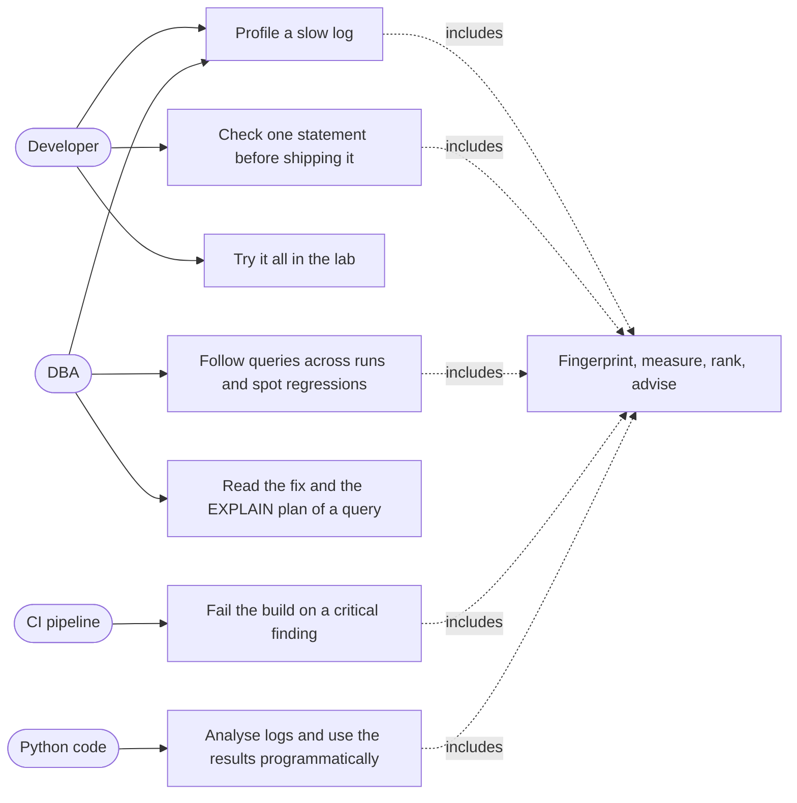
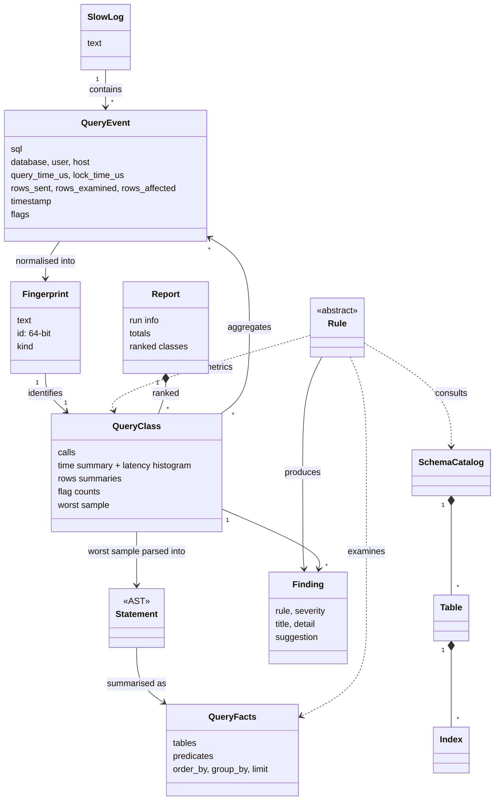
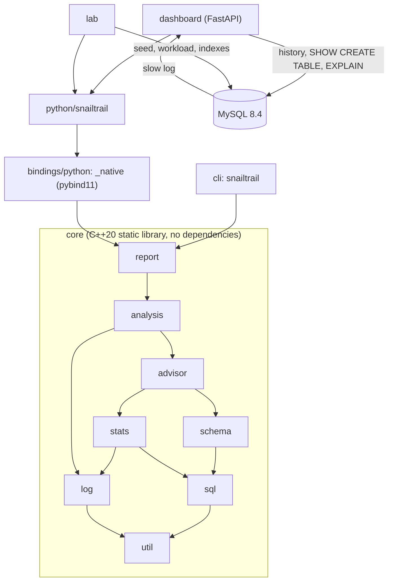
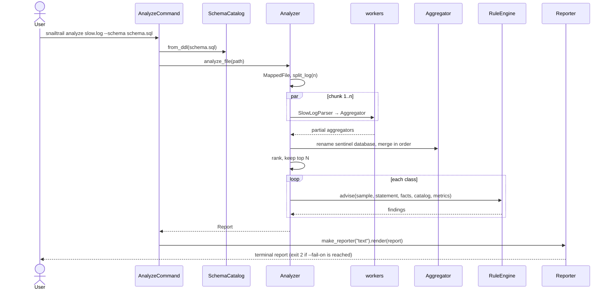
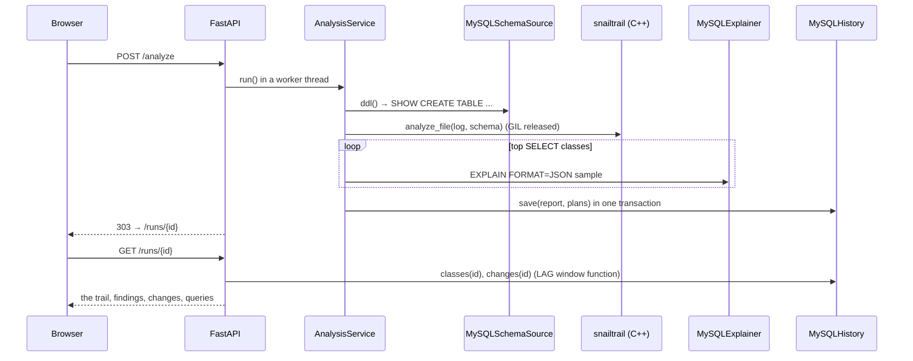

# SnailTrail — architecture and object-oriented design

This document is the analysis and design behind SnailTrail: what problem it solves, the
requirements that shaped it, its domain model, how the components collaborate, the design
patterns used and why, and the decisions that were weighed. Each folder's README goes one
level deeper into its own code.

- [1. The problem](#1-the-problem)
- [2. Requirements](#2-requirements)
- [3. Use cases](#3-use-cases)
- [4. Domain model](#4-domain-model)
- [5. Components and dependencies](#5-components-and-dependencies)
- [6. Key collaborations](#6-key-collaborations)
- [7. Design patterns](#7-design-patterns)
- [8. SOLID, concretely](#8-solid-concretely)
- [9. Concurrency](#9-concurrency)
- [10. Errors](#10-errors)
- [11. Testing strategy](#11-testing-strategy)
- [12. Decisions](#12-decisions)
- [13. Limits](#13-limits)

## 1. The problem

A MySQL server that gets slow rarely has one slow query. It has a few hundred distinct
statements, each run thousands of times with different values, and the cost is spread
across them. MySQL can log every statement with its timing (the *slow query log* with
`long_query_time = 0`), but that log is gigabytes of text: the raw data, not the answer.

Answering *"what should I fix first, and how?"* takes four steps:

1. **Group** executions of the same statement shape (a *query class*), whatever the values.
2. **Measure** each class: total time, how often, how slow in the tail (p95, p99), how many
   rows it reads for each row it returns.
3. **Rank** classes by what they cost the server.
4. **Explain** each expensive class: what in the SQL, the schema or the execution makes it
   slow, and the concrete change that fixes it.

Tools such as Percona's `pt-query-digest` do the first three. SnailTrail does all four, fast
enough to run on every deploy, and keeps the results over time so that a regression shows
up the day it ships.

## 2. Requirements

### Functional

| # | Requirement | Where |
|---|---|---|
| F1 | Read slow logs from MySQL 5.7/8.x (including `log_slow_extra`), Percona Server and MariaDB | [`core/src/log`](../core/src/log) |
| F2 | Group statements into classes by normalising values, formatting and comments | [`core/src/sql`](../core/src/sql) |
| F3 | Per class: calls, total/avg/min/max time, p50/p95/p99, lock time, rows sent/examined/affected, execution flags, databases, users, worst sample | [`core/src/stats`](../core/src/stats) |
| F4 | Rank classes by time, calls, average, p95, max or rows examined | [`core/src/analysis`](../core/src/analysis) |
| F5 | Diagnose each class with rules and propose a fix, SQL when possible | [`core/src/advisor`](../core/src/advisor) |
| F6 | Use the schema (from DDL) to verify index suggestions and column types | [`core/src/schema`](../core/src/schema) |
| F7 | Report as text, JSON and Markdown | [`core/src/report`](../core/src/report) |
| F8 | Command-line tool, usable as a CI gate | [`cli/`](../cli) |
| F9 | Python API | [`bindings/python`](../bindings/python), [`python/`](../python) |
| F10 | Keep runs in MySQL, compare runs, show `EXPLAIN` plans in a web UI | [`python/snailtrail/dashboard`](../python/snailtrail/dashboard) |
| F11 | A reproducible lab: database, data, workload, one command | [`compose.yaml`](../compose.yaml), [`python/snailtrail/lab`](../python/snailtrail/lab) |

### Non-functional

| # | Requirement | How it is met |
|---|---|---|
| N1 | **Throughput**: gigabytes in seconds | memory mapping, zero-copy parsing, no allocation per event, parallel chunks — about 290 MB/s on one thread, 1.9 GB/s on 16 |
| N2 | **Determinism**: same input, same report, whatever the thread count | integer arithmetic, ordered merges, explicit tie-breaks; tested bit for bit |
| N3 | **Robustness**: truncated logs, garbage bytes, exotic SQL | a lexer that never throws, parse errors that degrade to metric-only advice, bounded recursion |
| N4 | **Portability**: Linux, Windows, macOS | standard C++20 only; `mmap` / `CreateFileMapping` behind one class; the suite runs natively on Windows |
| N5 | **No runtime dependencies** in the core | the standard library and the platform's threads |
| N6 | **Safety of the target database** | read-only access for `SHOW CREATE TABLE` and `EXPLAIN`; only `SELECT`s are explained; nothing is ever executed on the target except in the lab |
| N7 | **Extensibility**: new rules, formats, stores, sources | abstract `Rule`, `Reporter`, `HistoryStore`, `SchemaSource`, `Explainer` |

## 3. Use cases



| Use case | Entry point |
|---|---|
| UC1 Profile a slow log | `snailtrail analyze slow.log --schema schema.sql` |
| UC2 Check one statement | `snailtrail advise "SELECT ..."` |
| UC3 Follow queries across runs | dashboard `/runs`, `/runs/{id}` |
| UC4 Read the fix and the plan | dashboard `/runs/{id}/classes/{digest}` |
| UC5 CI gate | `snailtrail analyze ... --fail-on critical --format markdown >> $GITHUB_STEP_SUMMARY` |
| UC6 The lab | `docker compose up` |
| UC7 Python | `snailtrail.analyze_file(...)` |

## 4. Domain model

The vocabulary, independent of how it is stored or computed:



Two observations shaped the design:

- **Events are transient, classes are durable.** A log holds millions of events and a few
  hundred classes. Events are processed as views into the log and never stored; classes
  keep only aggregates plus one sample.
- **Advice needs structure, grouping needs speed.** Grouping runs once per event and only
  needs tokens (the fingerprint). Advice runs once per class and needs a full parse. So
  there are two SQL paths: a fast, lenient token pass, and a real parser on the sample.

## 5. Components and dependencies



Dependencies point one way — from the product surfaces down to `util` — and the graph is
acyclic. Each C++ module is a folder with its own namespace (`snailtrail::sql`, ...), and
lower modules know nothing of higher ones: the parser does not know about rules, rules do
not know about reports, and nothing in the core knows about Python or MySQL.

## 6. Key collaborations

### Analysing a log



### A dashboard run



## 7. Design patterns

| Pattern | Where | Why here |
|---|---|---|
| **Composite** | `Expr` / `Statement` trees ([`sql/ast.hpp`](../core/include/snailtrail/sql/ast.hpp)) | SQL is recursive: an expression contains expressions |
| **Visitor** | `ExprVisitor`, `StatementVisitor`, `RecursiveExprVisitor`; used by the SQL writer, the tree printer, the precedence oracle, `FactsCollector`, `CatalogBuilder`, `NotInFinder` | the node set is fixed by the grammar while operations keep growing; a new analysis never touches the nodes |
| **Interpreter** (recursive descent) | `Parser` | one method per grammar rule, precedence climbing for operators |
| **Template Method** (non-virtual interface) | `Rule::evaluate()` → private virtual `check()` | prerequisites (AST, schema, metrics) are checked once, in the base class |
| **Strategy** | `Reporter` (text, JSON, Markdown); the analysis callable injected into `AnalysisService` | the algorithm is chosen at run time or replaced in tests |
| **Factory / Registry** | `make_reporter()`, `make_default_rules()`, `RuleEngine`, `App` registering `Command`s | construction by name; open for extension |
| **Command** | CLI subcommands (`Command::run`) | uniform dispatch, generated help, testable in-process |
| **Facade** | `Analyzer` | one call hides mapping, chunking, threads, merging, ranking and advice |
| **RAII** | `MappedFile`, `Parser::DepthGuard`, `Workers` (joins its threads), `py::gil_scoped_release`, `Database.cursor()` | resources and invariants released on every path, exceptions included |
| **Ports and Adapters** (hexagonal) | `HistoryStore`, `SchemaSource`, `Explainer` protocols with MySQL and in-memory adapters | the service does not know MySQL; tests and demo mode swap the adapters |
| **Repository** | `MySQLHistory`, `MemoryHistory` | persistence behind a collection-like interface |
| **Null Object** | `memory://` history; running without a schema or an explainer | features degrade instead of branching everywhere |
| **Value Object** | `Token`, `Fingerprint`, `Finding`, `QueryEvent`, the Python `@dataclass(frozen=True)` model | immutable, compared by value, safe to share across threads |

## 8. SOLID, concretely

- **Single responsibility.** The lexer tokenizes, the fingerprinter normalises, the parser
  builds trees, `FactsCollector` extracts facts, each rule judges one thing, reporters only
  format. `SlowLogParser` turns lines into events and does not know where lines come from
  (a mapped file, a pipe, a Python string).
- **Open/closed.** A new rule is a subclass plus one line in `make_default_rules()`; the
  engine, CLI, Python API and dashboard pick it up untouched. The same holds for a new
  report format or a new history store.
- **Liskov substitution.** Every `Reporter` renders any `Report`; `MemoryHistory` and
  `MySQLHistory` satisfy the same protocol and pass the same assertions (the MySQL suite
  checks it compares runs exactly like the in-memory one).
- **Interface segregation.** The dashboard service depends on three small protocols, not on
  one "database" object; `RuleContext` gives a rule only what it may read.
- **Dependency inversion.** High-level policy (`AnalysisService`, `RuleEngine`, `App`)
  depends on abstractions (`HistoryStore`, `Rule`, `Command`); concrete classes are wired in
  one composition root each (`build_services()`, `make_default_rules()`, `App()`).

Encapsulation is enforced, not just recommended: AST nodes are immutable with `const`
accessors and only the `Parser` (a `friend`) can populate statements; polymorphic bases
delete copy and move so nothing is sliced; the `Analyzer`, which points at its own default
rule engine, is neither copyable nor movable.

## 9. Concurrency

```
split_log ─┬─ chunk 0 ─> SlowLogParser ─> Aggregator ─┐
           ├─ chunk 1 ─> SlowLogParser ─> Aggregator ─┼─ rename sentinel ─> merge in chunk order ─> Report
           └─ chunk n ─> SlowLogParser ─> Aggregator ─┘
```

- **Share nothing.** Each worker owns its parser, fingerprinter and aggregator; no locks,
  no atomics on the hot path. The log is read-only memory shared by all.
- **The one piece of cross-chunk state** — which database is in effect at a chunk's start —
  is resolved after the fact: chunks start with a sentinel database, and each partial
  aggregator renames it before the merge. The `--database` filter needs the real name while
  parsing; that mode pre-scans in parallel and synchronises workers with a `std::latch`.
- **Determinism** comes from integers (microseconds, rows), exact histogram merges, merging
  in chunk order, strict comparisons for the worst sample and sorting by id where hash-map
  order would leak. A test compares one thread against eight across every metric and every
  finding's text.
- **Failures cross threads safely**: a worker's exception is captured as an
  `std::exception_ptr` and rethrown after every worker has joined.
- **Python**: the analysis releases the GIL; the dashboard runs it in a worker thread and a
  non-blocking lock turns a concurrent request into `409` instead of a second analysis.

## 10. Errors

| Layer | Strategy |
|---|---|
| Lexer, fingerprinter, slow-log parser | never throw; malformed input degrades (an unterminated string ends at the end, an unknown header is ignored) |
| Parser | `ParseError` with a byte offset; `parse_script` records it and continues; the rule engine turns it into metric-only advice plus an `ST000` note |
| Files | `std::system_error` with the OS error; `OSError` in Python |
| CLI | `UsageError` → exit 64, other exceptions → exit 1, findings at `--fail-on` → exit 2 |
| Dashboard | a failed run is shown in a banner with the likely fix; an unreachable schema source or a failed `EXPLAIN` is logged and the run continues without it |

## 11. Testing strategy

| Level | What | Tool |
|---|---|---|
| Unit (C++) | 164 cases: lexer, fingerprints, parser and writer round trips, schema, slow-log formats, histograms, every rule, analyzer, reporters, CLI | GoogleTest, CTest |
| Properties | chunked parsing equals sequential parsing; parallel aggregation equals sequential, bit for bit; SQL round trips are idempotent | GoogleTest |
| Memory safety | the whole suite under AddressSanitizer + UndefinedBehaviorSanitizer | GCC `-fsanitize` |
| Portability | GCC 14, Clang 18, MSVC and Apple Clang in CI; Clang 19 and a MinGW cross-build, run natively on Windows 11, locally | Docker, GitHub Actions |
| Python | the extension, the dashboard with fakes, every page and endpoint | pytest, FastAPI `TestClient` |
| Integration | MySQL adapters, window-function regressions, `SHOW CREATE TABLE`, `EXPLAIN`, seeding | pytest against MySQL 8.4 |
| Scenario | each lab scenario triggers the rule it was written for | pytest |
| Real data | a slow log written by MySQL 8.4.11 under the lab workload; the verdict is asserted in C++ and Python | GoogleTest, pytest |
| End to end | the Docker lab: seed, workload, analysis, dashboard, `EXPLAIN` | `docker compose up`, in CI |

Warnings are errors in CI (`-Werror`, `/WX`), and the Docker build runs the C++ suite: an
image cannot be built from a failing commit.

## 12. Decisions

**D1 — A hand-written lexer and parser, not a parser generator.** A generated MySQL
grammar is thousands of rules, pulls in a runtime, and fails hard on the first unexpected
token. Slow logs need the opposite: tolerance, precise error positions, and a tree shaped
for analysis rather than for execution. Recursive descent is ~1 500 lines, dependency-free,
and each quirk (keywords usable as column names, executable comments, `TRIM(LEADING ...
FROM ...)`) is handled where it occurs. *Cost*: coverage is what was written; stored
programs and a few rare operators are out of scope, and the advisor degrades gracefully.

**D2 — Visitor over `std::variant` for the AST.** Both work for a closed set of node types.
Virtual `accept` keeps node classes encapsulated and lets `RecursiveExprVisitor` provide
default traversal so a visitor overrides one method; operations are the growing axis.
*Cost*: a virtual call per node visit, irrelevant next to parsing.

**D3 — Integer microseconds.** Logs print six decimals; parsing them into `double` and
summing in different orders changes the last bits. Integers make sums exact and
associative, which is what makes the parallel result identical to the sequential one.

**D4 — FNV-1a-64 for class ids.** Stable across platforms and runs (it is stored in MySQL
and compared between runs), `constexpr`, a few lines. 64 bits make a collision among 100 000
classes about 3 × 10⁻¹⁰ likely.

**D5 — Memory mapping and chunking.** The log is mapped once and split at event boundaries;
events are views into it. *Alternative*: a reader thread feeding workers through a queue —
simpler to reason about for streams, but it copies every line and serialises on one reader.
Streams (`-`) still work, through the same line-driven parser, single-threaded.

**D6 — Resolving the database after parsing.** The obvious approach — scan each chunk for
its last `use db;` first — is a second full pass (a single-database server writes one `use`
at the top). Sentinel-and-rename costs a few tally updates. The pre-scan survives only for
`--database`, which needs the name while parsing.

**D7 — Native bindings rather than JSON over a subprocess.** pybind11 exposes the core's
own types, keeps one process, releases the GIL, and maps exceptions to Python ones. The
JSON report exists too — for CI and other languages.

**D8 — Ports and adapters in the dashboard.** The service is tested end to end in
milliseconds with in-memory adapters; the MySQL adapters get their own suite against a real
server. The same `MemoryHistory` gives a `memory://` demo mode for free.

**D9 — Regressions computed in SQL.** `LAG() OVER (PARTITION BY digest ORDER BY run_id)`
states "compared with the previous run in which this query appeared" directly; the Python
store implements the same definition, and a test asserts they agree. What counts as a
change is a `ChangePolicy`: a ratio of 1.5 either way, and at least 1 ms, and at least 10
calls in both runs — a ratio alone turns a 0.1 ms statement that once took 0.3 ms into a
"3× regression".

**D10 — Documentation next to the code, not in it.** Source files carry no comments;
every folder has a README that explains its files, its design and its trade-offs, and this
document ties them together. Names and small functions carry the *what*; the READMEs carry
the *why*.

## 13. Limits

- The advisor reasons about one statement at a time, without table sizes or column
  cardinalities; it says *what to check*, and `EXPLAIN` confirms. Subqueries and derived
  tables are not advised separately; a `UNION` is advised on its first branch.
- The parser covers the DML and DDL found in application logs, not stored-program bodies.
- `EXPLAIN` in the dashboard runs against the current schema and data, which may differ
  from when the query was logged.
- Database attribution relies on `use` lines and `Schema:` headers; a log truncated before
  its first `use` attributes the first events to no database.
